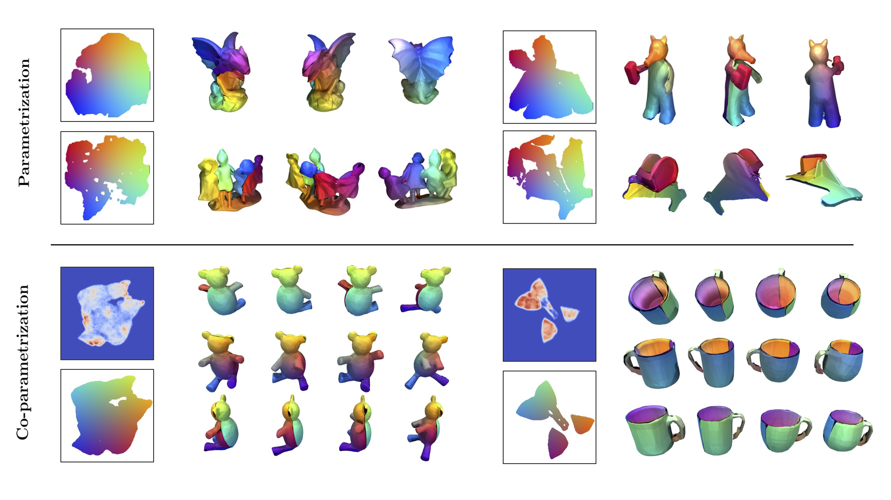

    

# Joint-Atlas-Surfaces

This work was build upon Thibault Groueix's [AtlasNet](https://github.com/ThibaultGROUEIX/AtlasNet) and my former project [Learning elementary structures]([https://github.com/ThibaultGROUEIX/AtlasNet](https://github.com/TheoDEPRELLE/AtlasNetV2))

This repository contains the source codes for the paper [Learning Joint Surface Atlases]().

:rotating_light: This is a **minimalistic version** of the code used to produce the results of the paper. You can find the dataset, the training losses and the architecture. This version of the code haven't been tested yet and his under construction. Most of the project features such as a trained model, visualisation, and evalution code will be added this summer 

### Citing this work

If you find this work useful in your research, please consider citing:

```
comming soon.
```

### Project Page

The project page is available http://imagine.enpc.fr/~deprellt/joint_altas/

### Before starting 
This project requires the [Chamfer distance](https://github.com/ThibaultGROUEIX/ChamferDistancePytorch) module developped by Thibault Groueix. It should be pull and placed inside the project folder. Please follow Thibaults instructions for installation of the module

### How to run this code :

```
comming soon.
```

## License

[MIT](https://github.com/ThibaultGROUEIX/AtlasNet/blob/master/license_MIT)
